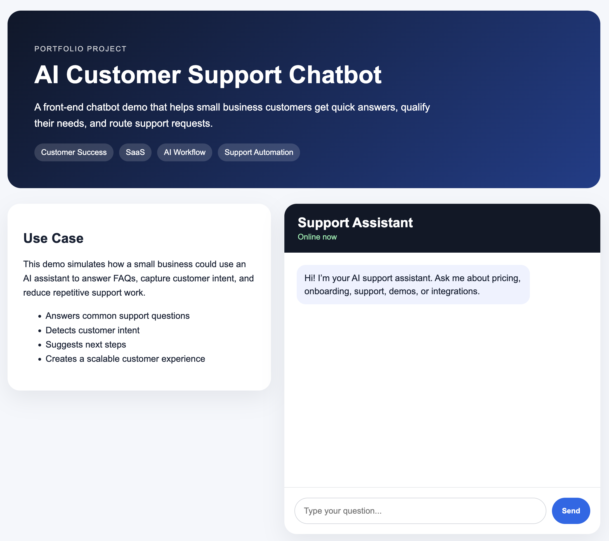
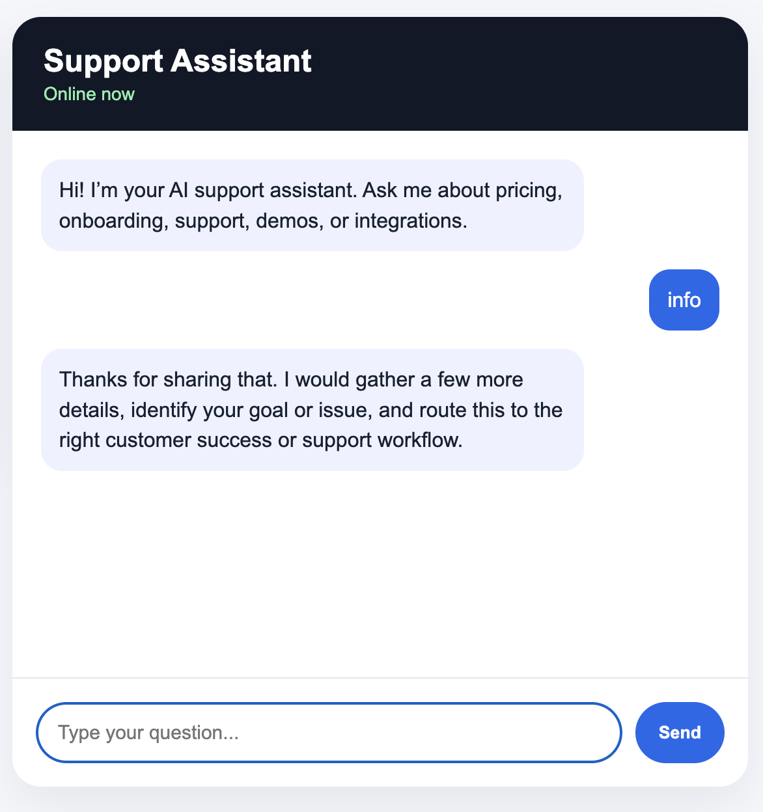
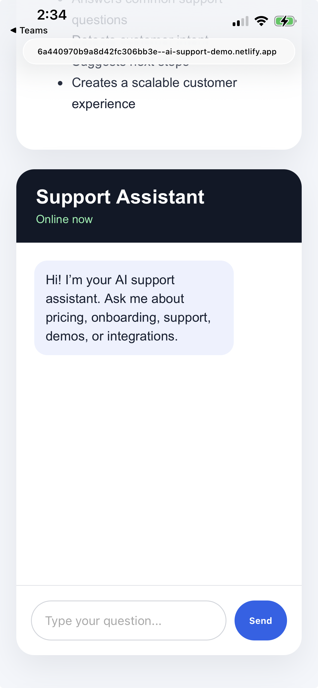

# AI Customer Support Chatbot Demo

This is a portfolio project showcasing a simple AI-style customer support chatbot workflow for small businesses and SaaS companies.

## Project Purpose

The goal of this project is to demonstrate how customer support automation can help businesses:

- Answer common customer questions
- Qualify customer intent
- Route support requests
- Improve onboarding and customer experience
- Reduce repetitive manual support work

## Features

- Responsive landing page
- Interactive chatbot interface
- Keyword-based intent detection
- Customer support use-case simulation
- Clean SaaS-style UI
- No API key required

## Technologies Used

- HTML
- CSS
- JavaScript
- GitHub
- Netlify or GitHub Pages

## Example Use Cases

This chatbot can be adapted for:

- SaaS support
- Small business websites
- Customer onboarding
- Lead qualification
- FAQ automation
- Service booking workflows

## Why I Built This

As someone with extensive experience in Customer Success, SaaS operations, onboarding, and client support, I wanted to create a practical demo showing how AI-assisted workflows can improve customer experience and support efficiency.

## Live Demo

[https://6a440970b9a8d42fc306bb3e--ai-support-demo.netlify.app/]

## Screenshots

### Homepage

### Chat Demo

### Mobile View

